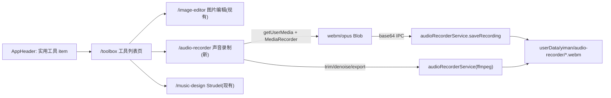

## 声音录制与实用工具页

### 架构与数据流

录制用渲染进程的 `MediaRecorder`（开始/暂停/停止），停止后把 Blob 经 base64 IPC 落盘到 `userData/yiman/audio-recorder/`；裁剪/降噪/导出全部由主进程 `ffmpeg`（系统已装）处理。播放用现有 `app:fs:readFileAsDataUrl`。

### 1. 导航与路由
- [`src/components/AppHeader.tsx`](src/components/AppHeader.tsx)：删除「图片」导航项；在「有声书」之后新增「实用工具」（`#icon-common-functions`，`navigate('/toolbox')`，active 条件 `pathname.startsWith('/toolbox')`）。在顶部隐藏判断里新增 `/audio-recorder`（与 `/music-design`、`/image-editor` 一样进入后隐藏顶栏；`/toolbox` 列表页仍显示顶栏）。
- [`src/App.tsx`](src/App.tsx)：新增两条路由
  - `/toolbox` → `ToolboxListPage`（`padding: '0px 24px'`，同有声书列表）
  - `/audio-recorder` → `AudioRecorderPage`（`padding: 0`）

### 2. 实用工具列表页（启动器）
- 新建 `src/toolbox/pages/ToolboxListPage.tsx` + `ToolboxListPage.css`：复用 [`src/audiobook/pages/AudiobookListPage.tsx`](src/audiobook/pages/AudiobookListPage.tsx) 的背景视频(`config.toolboxBgVideo`)+黑色遮罩+`Row`+[`ProjectCard`](src/components/ProjectCard.tsx) 范式。
- 工具定义为常量数组（标题/图标/路由）：图片编辑→`/image-editor`、声音录制→`/audio-recorder`、Strudel 音乐工作台→`/music-design`。卡片无封面图时用图标占位（ProjectCard 已支持无 cover）。

### 3. 声音录制页 `src/audioRecorder`（按功能拆分文件）
- `pages/AudioRecorderPage.tsx`：整体布局（左侧录音列表 + 右侧录制/编辑区），自带返回按钮（参考 [`MusicDesignPage`](src/musicDesign/pages/MusicDesignPage.tsx) 顶栏）。
- `components/RecordingList.tsx`：列出 `audio-recorder` 目录录音，支持选择/重命名/删除。
- `components/RecorderControls.tsx`：开始/暂停/继续/停止（实时计时、电平）。
- `components/AudioTrimEditor.tsx`：用 Web Audio `AudioBuffer` 在 `<canvas>` 画波形 + 可拖拽首尾裁剪手柄 + 播放（无新依赖）。
- `components/ExportBar.tsx`：降噪开关、导出 mp3/wav（走 `dialog.saveFile`）、以及「去背景音(demucs，需安装)」预留按钮。
- `hooks/useMediaRecorder.ts`：封装 `getUserMedia`+`MediaRecorder`（pause/resume/stop→Blob）。
- `hooks/useRecordingLibrary.ts`：列表加载/刷新。
- `utils/audioRecorderApi.ts`：`window.yiman.audioRecorder.*` 的薄封装。
- `AudioRecorderPage.css`：dark 主题样式。

### 4. Electron 主进程：ffmpeg 服务 + IPC + preload
- 新建 [`electron/main/audioRecorderService.ts`](electron/main/audioRecorderService.ts)（复用 `getFfmpegBinPath`/`runFfmpeg` 思路）：
  - `listRecordings()`：读 `userData/yiman/audio-recorder/` 下音频，返回名称/路径/mtime/大小
  - `saveRecording(base64, ext)`：写入新录音文件，返回路径
  - `getDuration(path)`：ffprobe 取时长（用于波形/裁剪范围）
  - `processRecording(path, { trimStart, trimEnd, denoise })`：`ffmpeg -ss/-to` 裁剪 + 可选 `-af afftdn`（降噪）生成新工作文件
  - `exportRecording(path, outPath, { format: 'mp3'|'wav', trim, denoise })`：编码导出（mp3 用 `libmp3lame -q:a 2`，wav 用 `pcm_s16le`）
  - `deleteRecording(path)` / `renameRecording(path, name)`
- [`electron/main/index.ts`](electron/main/index.ts)：注册对应 `app:audioRecorder:*` handlers（参考第 560-593 行写法）。
- [`electron/preload/index.ts`](electron/preload/index.ts)：新增 `audioRecorder` 命名空间暴露上述方法（导出/选择保存路径复用已有 `dialog.saveFile`）。

### 5. 设置-通用：实用工具动画背景
- [`src/types/settings.ts`](src/types/settings.ts)：`AISettings` 增加 `toolboxBgVideo?: string`。
- [`electron/main/settings.ts`](electron/main/settings.ts)：`AISettings` 接口 + load(第 280 行附近)/save(第 445 行附近) 增加 `toolboxBgVideo` 读写。
- [`src/pages/settings/GeneralSettingsPanel.tsx`](src/pages/settings/GeneralSettingsPanel.tsx)：在三个背景选择后新增「实用工具的动画背景」`Select`；`onApply` 的 `Pick` 类型加 `toolboxBgVideo`，表单默认/回填同其它项。
- [`src/pages/Settings.tsx`](src/pages/Settings.tsx)：`handleApplyGeneral` 的 `Pick` 与 patch 加入 `toolboxBgVideo`。

### 6. demucs 预留（首版仅占位）
- ExportBar 的「去背景音(demucs)」按钮先走一个返回「需安装」的占位 IPC（参考 [`electron/preload/index.ts`](electron/preload/index.ts) 中 `plugins.lamaCleaner*` 范式），首版用 ffmpeg `afftdn` 降噪满足基本需求，demucs 真正集成后续再接。

### 验证
- `yarn dev` 下：实用工具入口→列表→三个工具可跳转；录制→暂停/停止→落盘→列表出现；裁剪+降噪导出 mp3/wav 成功；设置-通用切换实用工具背景生效。
