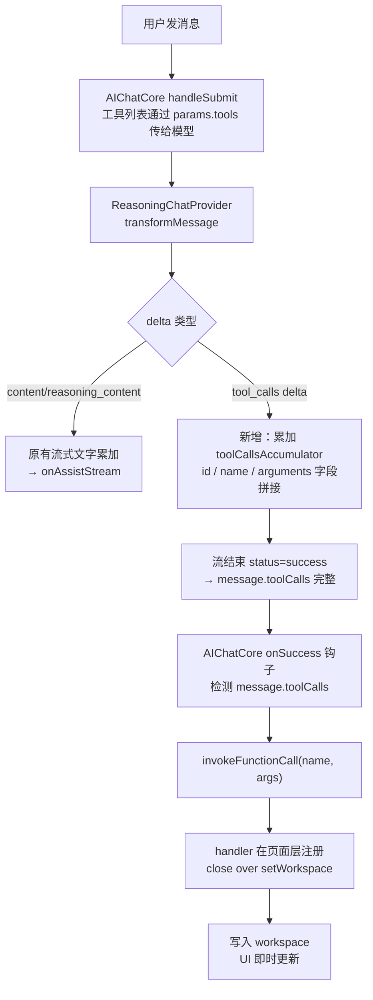

# 小说编辑 Function Call 规划

## 设计原则

- **文字生成（续写、重写、扩写…）** 继续走现有 `onAssistStream` 流式机制，保留实时预览
- **结构型操作（新建、重命名、排序、搜索替换…）** 走 Function Call，结果确定后一次性写入
- 所有 handler 通过 `extraFunctionCalls` 在页面层注入，close over `workspaceRef / setWorkspace`

---

## 一、Function Call 列表

### 查询类（返回数据给模型参考）

| name | 用途 | 主要参数 |
|---|---|---|
| `novel_list_episodes` | 列出全部集及 id/title/order | 无 |
| `novel_get_episode` | 读取某集完整正文 | `episode_id: string` |

### 章节管理

| name | 用途 | 主要参数 |
|---|---|---|
| `novel_create_episode` | 新建一集（可带初始正文） | `title: string`, `initial_content?: string`, `insert_after_id?: string` |
| `novel_rename_episode` | 重命名集标题 | `episode_id: string`, `new_title: string` |
| `novel_reorder_episode` | 调整集顺序（移到第 n 位） | `episode_id: string`, `new_order: number` |
| `novel_delete_episode` | 删除一集（UI 需二次确认） | `episode_id: string` |
| `novel_split_episode` | 在指定文本处拆分为两集 | `episode_id: string`, `split_marker: string`, `new_episode_title: string` |
| `novel_merge_episodes` | 合并相邻两集正文 | `episode_id_a: string`, `episode_id_b: string`, `separator?: string` |

### 内容编辑

| name | 用途 | 主要参数 |
|---|---|---|
| `novel_replace_content` | 精确/模糊搜索替换某集正文片段 | `episode_id: string`, `search: string`, `replacement: string`, `mode: 'first'\|'all'` |
| `novel_delete_segment` | 删除某集中匹配的文字段落 | `episode_id: string`, `search: string` |
| `novel_write_episode` | 追加或覆盖某集正文（非流式，配合多步操作） | `episode_id: string`, `content: string`, `mode: 'replace'\|'append'` |

### 大纲 / 书名

| name | 用途 | 主要参数 |
|---|---|---|
| `novel_update_outline` | 更新大纲集内容 | `content: string`, `mode: 'replace'\|'append'` |
| `novel_rename_novel` | 修改书名 | `new_title: string` |

---

## 二、实现架构（执行闭环）

当前缺口：`ReasoningChatProvider` 未解析 SSE 中的 `tool_calls` delta。

---

## 三、需要改动的文件

- **`src/components/AIChat/providers/ReasoningChatProvider.ts`**  
  - `ReasoningMessage` 增加 `toolCalls?: ToolCallItem[]` 字段  
  - `transformMessage` 识别 `delta.tool_calls` 并累加 `name` + `arguments`（流式拼接）

- **`src/components/AIChat/AIChatCore.tsx`**  
  - 在流结束回调（`onSuccess` / `onUpdate` 末尾）检测 `message.toolCalls`，依次调用 `invokeFunctionCall`  
  - 执行期间显示轻量状态提示（loading / 完成 toast）  
  - 工具调用结果以 `tool` role 消息追加到对话历史，支持模型多轮工具调用

- **新建 `src/novelDesign/AITools/novelEditorFunctionCalls.ts`**  
  - 导出 `buildNovelEditorFunctionCalls(opts: { workspaceRef, setWorkspace, novelId, ... })`  
  - 返回上面所有 `FunctionCallDef[]`，handler 通过 opts close over 状态

- **`src/novelDesign/pages/ScreenwriterNovelDetailPage.tsx`**  
  - `useMemo` 生成 `novelFunctionCalls`，传给 `<AIChat extraFunctionCalls={...} />`  
  - 向 `getNovelEditorProjectPrompt()` 传入当前 episodes 列表（含 id/title），让模型知道有哪些集

- **`src/novelDesign/prompts/novelEditorProjectPrompt.ts`**  
  - 接收 `episodes` 参数，在 System Prompt 里注入集列表 + 可用工具说明

---

## 四、可选后续

- `novel_delete_episode` 需 UI 确认弹窗，不直接在 handler 里删，而是抛给页面层的 confirm callback
- `novel_list_episodes` / `novel_get_episode` 为"只读"工具，不写 workspace，作为模型多步推理的中间步骤
- `novel_replace_content` 的"模糊搜索"可用简单的 `String.includes` + `Levenshtein distance`（≤3 编辑距离）降级
