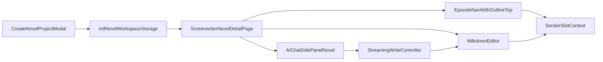

# 小说编辑页三栏工作台实施计划

## 目标与已确认决策
- **编辑器方案**：使用 `Milkdown` 作为中间正文的所见即所得 Markdown 编辑器。
- **AI 写入策略**：采用“按意图自动判断”：新建/重写类请求覆盖目标章节；续写类请求追加目标章节。
- **入口打通**：从“创建小说项目”成功后直接跳转 `"/screenwriter/novel/:id"`。

## 实施范围
- 将占位页 [ScreenwriterNovelDetailPage.tsx](/Users/yanfang/dev/Yiman/src/novelDesign/pages/ScreenwriterNovelDetailPage.tsx) 改造为三栏编辑工作台。
- 在 [CreateNovelProjectModal.tsx](/Users/yanfang/dev/Yiman/src/novelDesign/components/CreateNovelProjectModal.tsx) 中补上创建后跳转逻辑，并注入初始大纲数据。
- 复用 [AIChat.tsx](/Users/yanfang/dev/Yiman/src/components/AIChat/AIChat.tsx) + `agentKey="novel"` + SidePanel 模式作为右侧 AI 面板。

## 数据与交互设计
- 新增小说工作区存储层（建议新建 `src/novelDesign/storage/novelWorkspaceStorage.ts`）：
  - `projectId -> { title, outlinePage, episodes[], activeEpisodeId }`
  - `episodes[]` 含 `id/title/contentMarkdown/updatedAt/order`
  - 支持从抽卡大纲初始化“故事大纲页（置顶）”内容。
- 左侧导航规则：
  - 顶部固定搜索 + “添加集”按钮。
  - 第一项固定“故事大纲”（不可删除，置顶）。
  - 其余为 Episode 列表，点击切换中间编辑内容。
- 中间编辑区规则：
  - 使用 Milkdown 渲染/编辑 Markdown。
  - 文本选区变化时，生成“选中文本上下文”并推送到 AI Sender slot（作为 contextTag）。
- 右侧 AI 规则：
  - 章节切换时，同步当前章节信息到 Sender slot（章节名 + 简述）。
  - 选中文本时，追加“选中文本”slot。
  - AI 执行“创建新文件/写入内容”期间，中间编辑区禁用编辑；SSE 增量写入目标章节并实时刷新。

## 页面结构与样式
- 在 [ScreenwriterNovelDetailPage.tsx](/Users/yanfang/dev/Yiman/src/novelDesign/pages/ScreenwriterNovelDetailPage.tsx) 实现：
  - 顶栏：小说名称、`Episode` 侧栏显隐开关、`AI` 侧栏显隐开关。
  - Body：三列可伸缩布局（建议 `antd Splitter`，与项目现有技术栈一致）。
- 新增样式文件（建议 `ScreenwriterNovelDetailPage.css`）对齐暗色主题与现有 `screenwriter` 视觉风格。

## AI 写入与流式落盘策略
- 在小说编辑页本地维护 `aiWritingState`：
  - `idle | creating_episode | writing_episode`
  - `targetEpisodeId`, `mode(replace|append)`, `buffer`
- 通过右侧 AI 的会话内容增量监听（复用 SidePanel 的 streaming 状态）实现：
  - 判断意图关键词（新建/重写 vs 续写）选择覆盖或追加。
  - streaming 中逐步更新 `episodes[target].contentMarkdown`。
  - 完成后解除禁编并持久化。

## 路由与入口联动
- 在 [CreateNovelProjectModal.tsx](/Users/yanfang/dev/Yiman/src/novelDesign/components/CreateNovelProjectModal.tsx)：
  - 接收抽卡页创建时的 `outlineProse/fullAssistantContent/storyName`。
  - 创建成功后初始化 `novelWorkspaceStorage` 并跳转 `"/screenwriter/novel/:id"`。
- 在 [ScreenwriterAIDrawPage.tsx](/Users/yanfang/dev/Yiman/src/novelDesign/pages/ScreenwriterAIDrawPage.tsx)：
  - `onCreateProject` 时传入当前大纲正文，确保编辑页的“故事大纲页”有原始内容。

## 依赖与验证
- 通过包管理安装 Milkdown 相关依赖（不直接改 `package.json`）。
- 校验项：
  - 创建项目后自动进入编辑页。
  - 左侧“故事大纲页”置顶且内容正确。
  - 点击章节 -> 中间内容切换 + Sender slot 自动更新。
  - 选中文本 -> 工具条出现 + Sender slot 注入。
  - AI 流式写入时编辑区禁用，完成后恢复。

