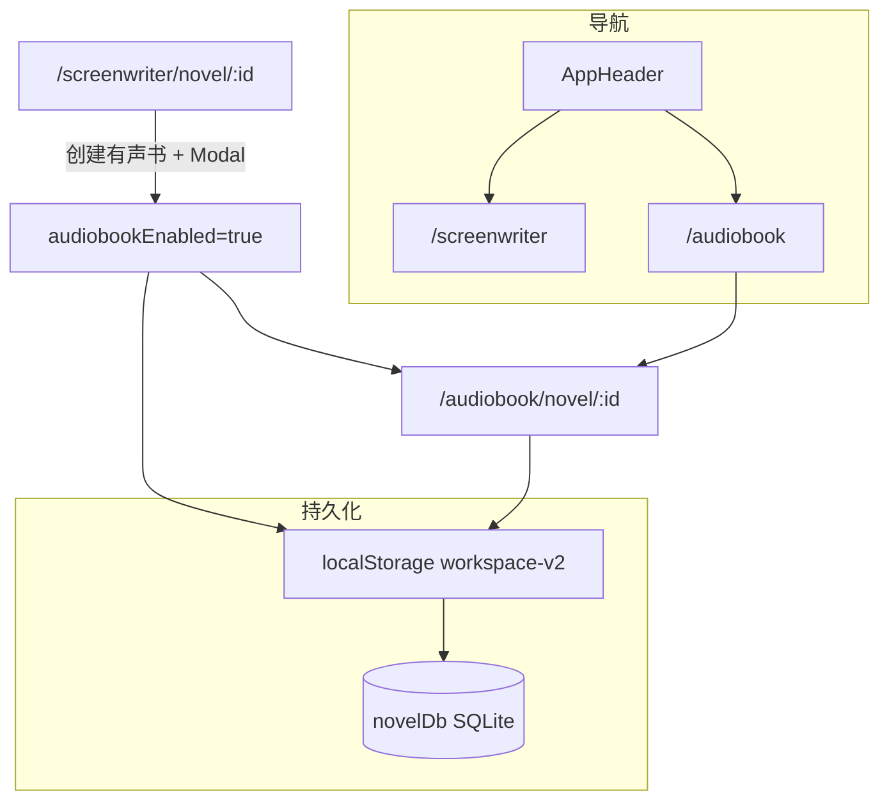

# 有声书工作台实现计划

## 目标与边界

| 能力 | 做法 |
|------|------|
| 列表 | [`AudiobookListPage`](src/novelDesign/pages/AudiobookListPage.tsx)：复用 [`ScreenwriterListPage`](src/novelDesign/pages/ScreenwriterListPage.tsx) 卡片/表格，**无**「手工新建 / 导入 / AI抽卡」 |
| 开通入口 | 仅 [`ScreenwriterNovelDetailPage`](src/novelDesign/pages/ScreenwriterNovelDetailPage.tsx) 顶栏 **AI 对话 Switch 后**「创建有声书项目」 |
| 目录 | **不**再弹目录选择；沿用 [`NovelWorkspaceSnapshot.electronProjectId`](src/novelDesign/storage/novelWorkspaceStorage.ts) 与小说共用 |
| 编辑页 | 参考小说编剧三栏；章节导航 + 小说正文 **只读**；顶栏 Radio：`小说` / `小说/有声书` / `有声书`（替换「剧本」） |
| 播放 | **首期**：文本类片段 → 本地 TTS 实时合成播放；`soundEffect` / `backgroundMusic` → `audioSrc` 用 `<audio>`（路径可占位） |
| AI | 基于 [`Audiobook.ts`](src/constants/Audiobook.ts) 的 `novel_audiobook_*` Function Calls + projectPrompt |



---

## 1. 数据模型与持久化

### 1.1 类型扩展

- [`NovelWorkspaceItem`](src/novelDesign/types/novelWorkspace.ts)：增加 `audiobookEnabled?: boolean`（列表过滤用）。
- [`NovelEpisode`](src/novelDesign/storage/novelWorkspaceStorage.ts)：增加 `episodeAudiobook?: AudiobookEpisode`（来自 `@/constants/Audiobook`）。
- 新建 [`src/novelDesign/utils/audiobookModel.ts`](src/novelDesign/utils/audiobookModel.ts)：
  - `createEmptyEpisodeAudiobook(ep)`、`parse/serialize` JSON
  - `normalizeSegments()`、`segmentHasPlayableText()`
  - 与 [`novelScriptModel.ts`](src/novelDesign/utils/novelScriptModel.ts) 同级，避免单文件过大

### 1.2 Storage API

在 [`novelWorkspaceStorage.ts`](src/novelDesign/storage/novelWorkspaceStorage.ts) 增加：

- `enableAudiobookForNovel(snapshot)`：为每个正文集初始化 `{ id, title, segments: [] }`；`upsertNovel` 写 `audiobookEnabled: true`
- `updateEpisodeAudiobook` / `getAudiobookEnabled`
- `syncSnapshotToDb`：`scriptJson` 旁增加 `audiobookJson: serializeEpisodeAudiobook(e.episodeAudiobook)`

### 1.3 Electron DB 迁移

[`electron/main/novelDb.ts`](electron/main/novelDb.ts)：

- `novels` 表：`audiobook_enabled INTEGER DEFAULT 0`
- `novel_episodes` 表：`audiobook_json TEXT DEFAULT ''`
- `upsert` / `replaceAllEpisodes` / hydrate 读写新字段

[`electron/preload/index.ts`](electron/preload/index.ts) + [`src/vite-env.d.ts`](src/vite-env.d.ts)：类型补齐。

---

## 2. 路由与导航

### 2.1 [`App.tsx`](src/App.tsx)

```text
/audiobook              → AudiobookListPage
/audiobook/novel/:id    → AudiobookNovelDetailPage
```

### 2.2 [`AppHeader.tsx`](src/components/AppHeader.tsx)

- 在「漫剧项目」**后**增加「有声书」链接 → `/audiobook`（图标可用已有 `SoundOutlined`）
- `isAudiobookNovelWorkspace` 与小说详情一样 **隐藏** 顶栏（`/audiobook/novel/:id`）

---

## 3. 有声书列表页

新建 [`AudiobookListPage.tsx`](src/novelDesign/pages/AudiobookListPage.tsx) + 复用 [`ScreenwriterListPage.css`](src/novelDesign/pages/ScreenwriterListPage.css)：

- `loadNovelList().filter(n => n.audiobookEnabled)`
- 封面仍用 [`resolveNovelCoverForDisplay`](src/novelDesign/utils/novelCoverImageCache.ts)
- 点击 → `navigate(/audiobook/novel/${id})`
- 空态文案：「请先在小说编剧工作台创建有声书项目」

---

## 4. 小说编剧页：创建入口

[`ScreenwriterNovelDetailPage.tsx`](src/novelDesign/pages/ScreenwriterNovelDetailPage.tsx) 顶栏，**AI 对话 Switch 后**：

```tsx
<Button onClick={onCreateAudiobookProject}>创建有声书项目</Button>
```

逻辑（新建 [`CreateAudiobookProjectButton.tsx`](src/novelDesign/components/CreateAudiobookProjectButton.tsx) 或内联）：

1. 若 `listItem.audiobookEnabled` 已为 true → 直接 `modal.confirm` 是否跳转 `/audiobook/novel/:id`
2. 否则 `enableAudiobookForNovel(workspace)` + `saveWorkspace` + `upsertNovel({ audiobookEnabled: true })`
3. Modal：「有声书项目已创建，是否进入有声书编辑页？」→ 确认则 `navigate`

**不**调用 `projects.create`，**不**询问目录。

---

## 5. 有声书编辑页（核心）

新建 [`AudiobookNovelDetailPage.tsx`](src/novelDesign/pages/AudiobookNovelDetailPage.tsx)，复用 [`ScreenwriterNovelDetailPage.css`](src/novelDesign/pages/ScreenwriterNovelDetailPage.css) + [`useWorkspaceSync`](src/novelDesign/hooks/useWorkspaceSync.ts)。

### 5.1 与小说编剧差异对照

| 项 | 小说编剧 | 有声书 |
|----|----------|--------|
| 返回列表 | `/screenwriter` | `/audiobook` |
| 封面按钮 | 有 | **无** |
| 中间 Radio | 小说 / 小说+剧本 / 剧本 | 小说 / 小说+有声书 / 有声书 |
| 集导航 | 可添加集 | **只读**（无「添加集」、无改名弹窗） |
| 小说区 | Crepe 可编辑 | Crepe **`readOnly`** |
| 第三栏 | 剧本 Script UI | **Audiobook 片段 UI** |
| AI 工具 | `novel_script_*` | `novel_audiobook_*` |
| 流式写正文 | `useNovelAiStream` | **关闭**（`shouldApplyNovelBodyStream: false`） |

### 5.2 可复用子组件

- [`NovelEpisodeNavReadonly.tsx`](src/novelDesign/components/NovelEpisodeNavReadonly.tsx)：从详情页抽出集列表（搜索 + 切换，无添加按钮）
- [`NovelCrepeEditor`](src/novelDesign/components/NovelCrepeEditor.tsx)：`readOnly={true}`

### 5.3 有声书内容区

- [`AudiobookEpisodePanel.tsx`](src/novelDesign/components/audiobook/AudiobookEpisodePanel.tsx)
  - 无 `segments` → 空态 +「生成有声书」按钮（类似剧本「生成剧本」，发 AI 指令）
  - 有数据 → 片段列表 + **集级播放**（顶部 `PlayCircleOutlined`）
- [`AudiobookSegmentCard.tsx`](src/novelDesign/components/audiobook/AudiobookSegmentCard.tsx)
  - 按 `SegmentType` 展示：类型 Tag、文本/音频源、`VoiceConfig` 摘要（tone/emotion）
  - 每条 **片段播放** 按钮
- [`useAudiobookPlayback.ts`](src/novelDesign/hooks/useAudiobookPlayback.ts)
  - 文本类：复用 [`LocalTtsPreview`](src/pages/LocalTtsPreview.tsx) 同款 AI 服务 `/api/v1/tts` + `localTts` 配置
  - 整集：顺序 `playSegment(i)`，尊重 `preDelayMs`/`postDelayMs`（`setTimeout` 链）
  - 播放中禁用重复点击、支持 `stop()`

大纲集选中时：有声书栏显示 `Empty`「故事大纲无有声书区」（与剧本 meta 区类似）。

---

## 6. AI：Agent + Tools + Prompt

### 6.1 Agent（可选但建议）

- 新建 [`novelToAudiobookAgent.ts`](src/components/AIChat/agents/novelToAudiobookAgent.ts) + 注册到 [`experts/index.ts`](src/components/AIChat/experts/index.ts)（`novel-to-audiobook`，能力 `novel` 或新 tag `audiobook` 若后续需要）
- 有声书页默认 `chatAgentKey: 'novel-to-audiobook'`

### 6.2 Function Calls

新建 [`novelAudiobookFunctionCalls.ts`](src/novelDesign/AITools/novelAudiobookFunctionCalls.ts)，模式对齐 [`novelScriptFunctionCalls.ts`](src/novelDesign/AITools/novelScriptFunctionCalls.ts)：

| 工具 | 作用 |
|------|------|
| `novel_audiobook_set_middle_view` | `novel` / `both` / `audiobook` |
| `novel_audiobook_get_episode` | 摘要：segment 数、类型分布 |
| `novel_audiobook_replace_episode` | 整集替换 `AudiobookEpisode` JSON |
| `novel_audiobook_add_segment` | 追加片段（兼容 AI 常用别名：`speaker`→`speakerId`，`line`→`text`） |
| `novel_audiobook_update_segment` | 按 index 更新 |
| `novel_audiobook_delete_segment` | 删除 |
| `novel_audiobook_reorder_segments` | 排序 |
| `novel_audiobook_list_characters` | 读 `novelScript.characters` 供 voice.characterId 对齐 |

`extraFunctionCalls` 在有声书页 **仅合并** editor 只读类（列表/打开集）+ audiobook 全套；**不**合并 `novel_script_*`（或合并但 prompt 禁止调用）。

### 6.3 Prompt

- [`novelAudiobookProjectPrompt.ts`](src/novelDesign/prompts/novelAudiobookProjectPrompt.ts)：说明 `Audiobook` 片段类型、必须从正文提取对白进 `dialogue`/`narration`/`innerVoice`，禁止写 `novel-body-json`
- 生成有声书按钮指令：切换视图 → 按正文分场/分段 `novel_audiobook_add_segment`

---

## 7. 测试与验收

- 单测：[`audiobookModel.test.ts`](src/novelDesign/utils/audiobookModel.test.ts)（parse、normalize、别名映射）
- 手动验收清单：
  1. 小说详情创建有声书 → 列表出现 → 进入编辑页
  2. 集导航不可增删改标题；小说只读
  3. AI `add_segment` 后片段可见；对白非空
  4. 片段播放 / 整集播放有声音（TTS 已配置时）
  5. 刷新后 `audiobook_json` 仍能从 DB 恢复

---

## 8. 建议实施顺序

1. 数据层（类型 + storage + DB + IPC）
2. 列表 + 导航 + 创建入口 Modal
3. Audiobook UI 组件 + 播放 hook
4. AudiobookNovelDetailPage 接线
5. `novel_audiobook_*` + prompt + 生成按钮
6. 单测 + 手动验收

## 不在本期范围

- 整集混音导出单一音频文件
- 有声书独立封面 / 独立 electron 项目目录
- 列表页「创建」按钮
