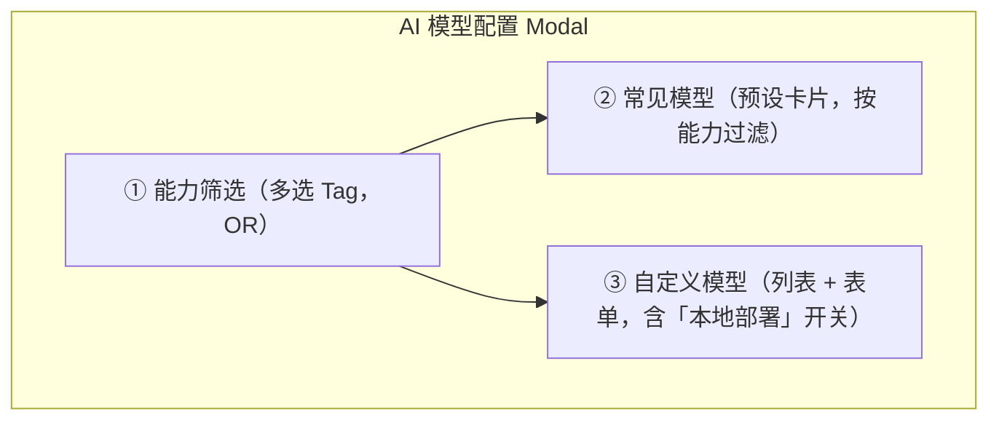
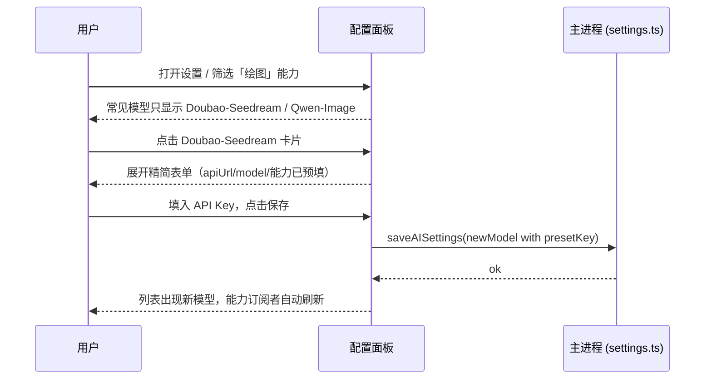

# 芝绘 - 功能文档

## 1. 产品概述

**芝绘** 是一款基于 Electron + React + Ant Design 的桌面应用，用于**快速开发 2D 短漫剧**。用户可在本地管理漫剧项目、编写剧情与角色、使用 AI 辅助创作，并通过漫剧视频设计器完成分镜与导出视频。

---

## 1.1 术语表（视频设计器与素材）

以下术语在功能文档与技术文档中统一使用：

| 术语 | English | 说明 |
| ---- | ------- | ----- |
| **画布** | Canvas | 导出视频时观众看到的「有效区域」，尺寸与项目横竖屏一致；别名**视口**（Viewport） |
| **工作区** | Workspace | 素材可摆放、移动的「操作空间」，承载画布及溢出内容；超出画布部分可见可编辑，用于飞入/飞出、位移等动画设计，导出时仅画布内内容被渲染 |
| **播放器面板** | Player Panel | 内含工作区与播放控制 |
| **时间线** | Timeline | 时间尺、轨道、素材条、选中时间轴的整体区域 |
| **时间线面板** | Timeline Panel | 视频设计器最下方独立面板，支持高度 Resize |
| **主轨道** | Main Track | 每个分镜默认的唯一主轨道，素材无间隔紧密堆叠，主轨道不可被删除 |
| **次轨道** | Secondary Track | 主轨道之外的其他轨道，素材可自由放置、允许空隙 |
| **素材条** | Block / Clip | 表示某素材在时间线上的出现区间，可在轨道上拖动 |
| **占位指示条** | Drop Placeholder Bar | 拖拽素材到轨道时显示的预览条，兼具「占位」与「预览位置」功能，用户一眼可识别「这是素材即将放下的位置」 |
| **选中时间轴** | Playhead | 表示当前播放/预览对应的时间位置，红色竖线，可水平拖拽跳转 |
| **素材面板** | Assets Panel | 素材浏览所在面板，角色/本地/特效/声效/音乐等 Tabs |
| **功能面板** | Properties Panel | 当前分镜设置 + 选中素材设置（基础设置/精灵图设置） |
| **素材** | Asset | 所有可添加到画布的内容（见 1.2） |
| **本地素材** | Local Asset | 用户本地上传或导入的图片、视频、音频等文件 |
| **预设素材** | Preset Asset | 应用内置素材 |
| **元件** | Component Group | 设计器中未保存为素材前的复杂组合体 |
| **镜头** | Camera | 虚拟相机，通过调整其位置、缩放、旋转实现画面的推拉、平移、摇镜等效果；素材与画布固定，镜头移动（参考 AE Camera 图层、Toon Boom Harmony Camera Tool） |
| **镜头平移** | Pan | 镜头在画布平面内平移，改变取景范围 |
| **镜头缩放** | Zoom | 镜头缩放视角（放大 = Zoom In，缩小 = Zoom Out） |
| **镜头跟随** | Tracking | 镜头跟随某目标（如某素材或锚点）移动 |

**镜头核心逻辑**：素材和合成画布的位置、大小不变，通过调整「镜头」的属性（位置、缩放、旋转）来实现画面的推拉、平移、摇镜等效果。专业软件参考：AE 里的「Camera」图层、Toon Boom Harmony 里的「Camera Tool」，均为画布固定、镜头移动的逻辑。

### 1.2 素材定义

**素材**（Asset）：所有可向**画布**中添加的内容均为素材，包括：

- **本地素材**：本地上传的图片、视频、语音等文件
- **预设素材**：应用内置的图片、视频、音频等
- **精灵图**（Sprite）：多帧序列图，可在画布上按帧播放动画
- **骨架角色**（Skeleton Character）：带骨骼绑定的可动画角色

**不属于素材**：用于设计精灵图、骨架角色的**贴图蒙板**、线稿等，仅为素材制作辅料，不作为可添加到画布的独立素材。

---

**用户习惯持久化**：以下状态自动保存到 **localStorage**，下次打开时恢复：
- 漫剧视频设计器：三个 Toggle（剧集分镜、素材面板、AI Chat）的显示/隐藏；
- 项目编辑页：默认选中的 Tab（剧情大纲 / 角色设计 / AI 配置 / 漫剧视频设计器）；
- 漫剧视频设计器内：默认选中的剧集与分镜。

---

## 2. 漫剧项目列表

### 2.1 功能说明

- **列表展示**：展示所有漫剧项目，每项显示基础信息。
- **新建项目**：创建新漫剧项目，需填写/选择必要信息；本地项目目录支持**手动输入路径**或点击按钮选择。
- **导入项目**：选择已有项目目录，解析该目录下的 `project.db` 后加入列表；若无法解析则提示导入失败。
- **打开编辑**：进入项目编辑主界面（剧情大纲、角色设计、AI 配置、漫剧视频设计器）。
- **删除项目**：删除项目记录；需明确是仅删除应用内记录，还是同时删除本地项目目录及资源（建议二次确认）。

### 2.2 漫剧信息字段

| 字段         | 说明                                   |
| ------------ | -------------------------------------- |
| 名称         | 漫剧名称，必填                         |
| 横屏/竖屏    | 画布与导出视频的宽高方向               |
| 本地项目目录 | 项目文件与资源所在目录，唯一且不可重复 |
| 封面         | 项目封面图（用于列表展示）             |
| 创建时间     | 自动记录                               |
| 更新时间     | 每次保存/编辑后更新                    |

### 2.3 补充与约定

- 列表支持按名称、创建时间、更新时间排序与简单搜索。
- 删除前需确认，并可选「仅从列表移除」或「同时删除本地目录」。
- 若本地项目目录已被删除或移动，列表项应能标识「路径无效」并支持重新指定路径或移除。

---

## 3. 设置面板

### 3.1 AI 模型配置

不同模型有不同的擅长方向（如绘图、抠图、生成精灵图、生成骨骼蒙皮、生成动作脚本、生成剧本、生成配音、生成音乐、生成语音特效、生成执行脚本、生视频、Agent 调度等）；一个模型可能拥有多种能力，因此**能力需 tag 化**（每个 tag 含 label 与英文 key）。允许用户**添加多个模型**，在添加与编辑模型时可设置**能力 tag**。

**预设能力 tag**（key | label）：

| key | label |
| --- | --- |
| `draw` | 绘图 |
| `matting` | 抠图 |
| `sprite` | 生成精灵图 |
| `skeleton_skinning` | 生成骨骼蒙皮 |
| `action_script` | 生成动作脚本 |
| `script` | 生成剧本 |
| `voice_over` | 生成配音 |
| `music` | 生成音乐 |
| `sound_effect` | 生成语音特效 |
| `exec_script` | 生成执行脚本 |
| `video` | 生视频 |
| `agent_orchestration` | Agent 调度 |

**配置面板展示方式**：可在任意界面以 Modal 形式打开（`useConfigModal()`，见 `docs/配置订阅使用.md`），无需跳转路由。

**配置订阅模式**：配置修改后，根据订阅记录通知被订阅方；调用方通过订阅获取最新配置，详见 `docs/配置订阅使用.md`。

#### 3.1.1 面板结构（三段式）

为了降低用户操作难度，模型配置面板竖向分为三段，**能力筛选同时作用于「常见模型」与「自定义模型」两段**（OR 语义，全不选即显示全部）：

1. **能力筛选**：展示 12 个能力 Tag，可多选；选中任一 Tag 则仅显示「具备至少一个所选能力」的预设卡片与自定义模型。默认不选表示「显示全部」。
2. **常见模型**：展示 15 个**预设卡片**（见 3.1.3）。卡片上显示：模型显示名、能力 Tag、若为本地部署则显示「本地」徽标；已添加过同 `presetKey` 的卡片显示「已添加」标记并支持跳转到该条记录编辑。点击卡片 → 右栏展开**精简表单**：
   - 预填 `apiUrl`、默认 `model`、能力 Tag、`provider`、`presetKey`、`isLocal`；
   - 用户**只需填写 API 密钥**（本地部署预设自动隐藏密钥字段）；
   - 允许微调 `model`（如选择具体版本）与显示名；
   - 表单头显示该模型「官方文档」超链接，用户可点击查看参数说明。
3. **自定义模型**：沿用列表 + 右栏编辑的交互。表单字段：名称（可选）、供应商类型、API 地址、API 密钥、模型名、能力多选、**本地部署**开关（`isLocal`）。勾选「本地部署」后：
   - 隐藏「API 密钥」字段（保存时 `apiKey` 写入空串）；
   - `apiUrl` 预填 `http://127.0.0.1:11434/v1`（可改）；
   - 卡片显示「本地」徽标；
   - 保留「本地 LLAMA」示例说明（Ollama 或 llama.cpp-server，OpenAI 兼容根路径为 `http://127.0.0.1:11434/v1`）。

用户流程：

#### 3.1.2 数据结构扩展（向下兼容）

在现有 `AIModelConfig` 基础上追加两个可选字段（见 `src/types/settings.ts`）：

| 字段 | 类型 | 说明 |
| --- | --- | --- |
| `presetKey` | `string?` | 由预设卡片一键添加时写入（如 `doubao_seedream`）。用于 UI 判定「该预设是否已添加」与后续自动迁移。无值视为自定义模型 |
| `isLocal` | `boolean?` | 本地部署标记。为 `true` 时业务侧请求不带 `Authorization` 头；UI 在表单中隐藏密钥字段 |

`CAPABILITY_TAGS` 新增 `{ key: 'agent_orchestration', label: 'Agent 调度' }`；其余字段保持不变。旧配置读取时 `presetKey` / `isLocal` 默认为 `undefined` / `false`，等价于「自定义云端模型」。

#### 3.1.3 常见模型预设清单

下表为面板「常见模型」段展示的 15 个预设，保存时均写入 `AISettings.models`（与自定义模型同一存储）。标注 `（需复核）` 的默认 `model` / 文档链接请用户在实际接入时以官方最新文档为准。

| presetKey | 显示名 | capabilityKeys | 默认 apiUrl | 默认 model | isLocal | 官方文档 |
| --- | --- | --- | --- | --- | --- | --- |
| `doubao_seed` | Doubao-Seed | `action_script`, `script`, `exec_script` | `https://ark.cn-beijing.volces.com/api/v3` | `doubao-seed-1-6-250615`（需复核） | ❌ | https://www.volcengine.com/docs/82379 |
| `doubao_seedance` | Doubao-Seedance | `video` | `https://ark.cn-beijing.volces.com/api/v3` | `doubao-seedance-1-0-lite-t2v-250428`（需复核） | ❌ | https://www.volcengine.com/docs/82379/1362931 |
| `doubao_seedream` | Doubao-Seedream | `draw` | `https://ark.cn-beijing.volces.com/api/v3` | `doubao-seedream-4-0-250828`（需复核） | ❌ | https://www.volcengine.com/docs/82379/1541523 |
| `doubao_seed_character` | Doubao-Seed-Character | `script` | `https://ark.cn-beijing.volces.com/api/v3` | `doubao-seed-character`（需复核） | ❌ | https://www.volcengine.com/docs/82379 （需复核） |
| `doubao_tts` | Doubao-语音合成 | `voice_over` | `https://openspeech.bytedance.com`（需复核） | `—`（见文档） | ❌ | https://www.volcengine.com/docs/6561/1257544 |
| `doubao_music` | Doubao-音乐大模型 | `music` | `https://ark.cn-beijing.volces.com/api/v3` | `—`（需复核） | ❌ | https://www.volcengine.com/docs/82379 （需复核） |
| `deepseek` | DeepSeek | `action_script`, `script`, `exec_script` | `https://api.deepseek.com/v1` | `deepseek-chat` | ❌ | https://platform.deepseek.com/docs |
| `qwen` | Qwen | `action_script`, `script`, `exec_script` | `https://dashscope.aliyuncs.com/compatible-mode/v1` | `qwen-plus` | ❌ | https://help.aliyun.com/zh/dashscope/developer-reference/compatibility-of-openai-with-dashscope |
| `qwen_image` | Qwen-Image | `draw` | `https://dashscope.aliyuncs.com/compatible-mode/v1` | `qwen-image` | ❌ | https://help.aliyun.com/zh/dashscope/developer-reference/qwen-image-api |
| `qwen_image_edit` | Qwen-Image-Edit | `matting` | `https://dashscope.aliyuncs.com/compatible-mode/v1` | `qwen-image-edit`（需复核） | ❌ | https://help.aliyun.com/zh/dashscope/developer-reference/qwen-image-edit-api （需复核） |
| `qwen_tts` | Qwen-TTS | `voice_over` | `https://dashscope.aliyuncs.com/compatible-mode/v1` | `qwen-tts-latest`（需复核） | ❌ | https://help.aliyun.com/zh/dashscope/developer-reference/qwen-tts-api |
| `cosyvoice` | CosyVoice | `voice_over` | `https://dashscope.aliyuncs.com/api/v1` | `cosyvoice-v1` | ❌ | https://help.aliyun.com/zh/dashscope/developer-reference/cosyvoice-quick-start |
| `xiaomi_mimo_tts` | 小米 MiMo TTS | `voice_over` | `https://api.xiaomimimo.com/v1` | `mimo-v2-tts` | ❌ | https://platform.xiaomimimo.com/#/docs/quick-start/first-api-call |
| `moss_tts` | MOSS-TTS | `voice_over` | `http://127.0.0.1:8000/v1`（用户改） | `moss-ttsd`（需复核） | ✅ | https://github.com/OpenMOSS/MOSS-TTSD （需复核） |
| （自定义-本地） | 本地 LLAMA | 由用户选择 | `http://127.0.0.1:11434/v1` | 由用户填写 | ✅ | https://ollama.com/docs |

说明：

- 「本地 LLAMA」**不作为预设卡片**出现，仅在「自定义模型」段作为「本地部署模板」提示。用户点击「添加自定义模型 → 勾选『本地部署』」即可得到该模板默认值。
- Doubao-语音合成（WebSocket 协议）、Doubao-音乐大模型的具体接入协议**与现有 OpenAI 兼容通道不同**，本轮仅在面板上支持「配置项落盘」；真正调用需要在 TTS/Music 适配器中扩展（列入 `docs/03-开发计划和进度.md`）。

#### 3.1.4 本地部署统一规则

- 识别方式：`AIModelConfig.isLocal === true`。
- 请求规则：不带 `Authorization` 头（即使 `apiKey` 为空字符串也允许保存）。
- UI 规则：表单隐藏「API 密钥」字段，卡片显示「本地」徽标。
- 订阅者应按需过滤：需要云端稳定性的分镜（如付费 API 计费）可排除 `isLocal: true` 的模型；允许本地部署的分镜（TTS、Chat）直接按 `capabilityKeys` 匹配即可。

#### 3.1.5 「抠图」能力双通道策略

「抠图」存在两种互补通道，**并存**：

- **通道 A（历史）**：`AIMattingConfig`（火山引擎 AccessKey/Secret，见 `docs/AI抠图配置说明.md`）；由视频去背景、精灵图抠图等已有功能消费。
- **通道 B（新增）**：`AIModelConfig.capabilityKeys` 含 `matting`（如 Qwen-Image-Edit）；走 OpenAI 兼容密钥。

**业务侧优先级**：默认优先使用「通道 A」的启用中记录；若无可用 `AIMattingConfig` 且存在 `capabilityKeys:['matting']` 的 `AIModelConfig`，则回落到「通道 B」。未来可在抠图服务选择 UI 中提供显式切换。

#### 3.1.6 文本转语音（TTS）与「生成配音」能力

- 芝绘**不内置**语音合成模型与推理进程；用户通过「设置」中具备 `voice_over` 的模型接入本机或云端服务，剧本与视频设计器中的「TTS 配音」仅可选择此类模型。
- **本地接入**：若使用 Ollama、MOSS-TTS、llama.cpp-server 或自建网关，需对外提供与本应用可对接的 HTTP 接口。应用支持 **OpenAI 兼容的** `POST {apiUrl}/audio/speech`（`apiUrl` 为带 `/v1` 的根地址时）或等价路径；勾选「本地部署」即可免填密钥。
- **云端小米 MiMo**：在设置「常见模型」中选择「小米 MiMo TTS」预设，填写控制台 API Key 后保存；官方文档：[小米 MiMo 开放平台 - 首次调用](https://platform.xiaomimimo.com/#/docs/quick-start/first-api-call)。
- 旧版项目数据若曾保存引擎 id `local_moss`，打开 TTS 时会自动回退到当前配置中第一个具备 `voice_over` 的模型。

### 3.2 后续可扩展

- 代理设置、语言/地区、快捷键、主题等可留入口，本版实现 AI 模型配置与订阅。

---

## 4. 漫剧编辑

漫剧编辑包含四个主模块：**剧情大纲**、**角色设计**、**AI 配置**、**漫剧视频设计器**。四者共享同一项目上下文（项目信息、素材分类、AI 配置等）。Tab 栏左侧为「返回项目列表」与项目名，右侧为「设置」入口。

### 4.1 剧情大纲

- **布局**：左侧集列表（默认 200px）、中间概要/剧本编辑、右侧漫剧剧本专家 Chat（默认 320px），使用 Splitter 可拖拽调整宽度。
- **按集划分**：每集有标题、顺序、可选摘要。
- **概要/剧本内容**：每集可编辑剧情概要及详细剧本文本。
- **AI 漫剧剧本专家 Agent Chat**：
  - 在界面提供专用 Chat 区域，与「漫剧剧本专家」Agent 对话。
  - 支持基于当前大纲/剧本进行生成、修改、扩写、缩写等。
  - 生成或修改的结果可一键或选择性地写回对应集的概要/剧本。

### 4.2 角色设计

- **布局**：左侧角色列表（默认 240px）、右侧角色编辑，使用 Splitter 可拖拽调整宽度。
- **角色列表**：管理本漫剧中所有角色（含动物等，统一归为「角色」）。
- **角色信息**：名称、形象资源（图片/资源包引用）、备注等。
- **形象来源**：
  - 本地上传或从项目素材库选择。
  - 使用 **AI 漫剧绘画 Agent** 生成形象，生成结果可保存为项目素材并绑定到该角色。
- **默认 TTS 参数**：每个角色可配置一套默认 TTS 参数（如音色、语速等），在视频设计器中为该角色添加对白时可默认带入 TTS 编辑面板；实际合成依赖「设置」中已配置的 `voice_over` 模型（见 3.1.1）。

### 4.3 AI 配置（项目级）

- **漫剧剧本专家**：本项目下对剧本专家的自定义要求/系统提示（如风格、篇幅、角色设定等）。
- **漫剧绘画**：本项目下对绘画 Agent 的自定义要求（如画风、线稿/上色偏好等）。
- 与全局「设置面板」中的多模态供应商配置区分：此处仅负责「本项目内」的 prompt/偏好，不涉及 API 密钥等。

### 4.4 漫剧视频设计器

视频设计器是分镜与成片制作的核心界面，详见第 5 节。

---

## 5. 素材体系

**素材**：所有可向**画布**中添加的内容均为素材，包括本地上传的图片、视频、语音，预设素材，**精灵图**、**骨架角色**等。用于设计精灵图、骨架角色的贴图蒙板等仅为素材制作辅料，不属于素材。

### 5.1 素材分类

每个漫剧项目内，素材按**唯一分类**管理，分类包括：

| 分类           | 说明与示例                           |
| -------------- | ------------------------------------ |
| 角色           | 角色形象、精灵图、骨架角色等         |
| 分镜背景       | 山水、天空、室内等背景图/视频        |
| 情景道具       | 马车、桌椅等可与剧情联动的道具       |
| 声效           | 音效文件                             |
| 透明视频特效   | 带透明通道的视频特效                 |
| 音乐           | 背景音乐等                           |
| 贴纸           | 静态或简单动效贴纸                   |

### 5.2 素材来源与元件

- **本地素材**：用户本地上传或导入到项目中的图片、视频、音频等文件。
- **预设素材**：软件自带的素材。
- **精灵图 / 骨架角色**：从角色设计等模块制作的可动画素材。
- **元件**：在设计器中可设计复杂组合并方便复用的对象，在**保存成素材前**称为元件；保存后归入上述分类。

### 5.3 抠图与视频去背景的文件管理

上传到项目中的图片、视频素材，允许用户进行**抠图**（图片）或**视频去背景**（Chroma Key）操作：

- **操作后**：用户在预览、画布、素材面板等所有位置看到的应为**处理后的新文件**（如去背景后的透明 WebM），而非原始文件。
- **原始文件必须保留**：因为再次执行抠图/去背景操作时，**必须基于原始文件重新处理**（而非基于上次处理结果叠加处理），以保证输出质量。
- **数据模型**：素材表中 `path` 字段始终指向当前展示用的文件（处理后为新文件路径）；`original_path` 字段保存原始文件路径，仅用于重新处理的输入源。
- **刷新一致性**：抠图/去背景完成后，所有引用该素材的页面（角色页、素材页、设计器画布、预览抽屉等）均应**即时刷新**为处理后的文件。

### 5.4 素材包（Package）

- 一种特殊素材形态：一个 **Package** 对应一个资源包目录，内含：
  - 若干资源文件（图、视频、音频等）；
  - 一个 **YAML 描述文件**，用于声明：
    - 素材基本信息（名称、分类、描述等）；
    - **状态** 与 资源组/资源/唯一素材 ID 的对应（如道具「马车」：状态「行驶中」→ 某资源，「停止」→ 某资源）；
    - **Tag** 与 资源组/资源/唯一素材 ID 的对应（便于筛选与批量引用）。
- 在**工作区**或**时间线**中使用「带状态的素材」时，通过切换状态或配合关键帧，可在不同时间点展示不同形态（如马车从行驶中变为停止）。

---

## 6. 漫剧视频设计器界面

### 6.1 整体布局（宽度适配窗口）

- **顶部（项目编辑页 Tab 栏）**
  - 左侧：返回项目列表、项目名。
  - 中间：切换按钮组 **剧情大纲**、**角色设计**、**AI 配置**、**漫剧视频设计器**。
  - 右侧：设置入口；漫剧视频设计器 Tab 时显示三个 Toggle（剧集分镜、素材面板、AI Chat）及全集播放、全部播放、导出视频。以上 Toggle 与默认剧集/分镜、项目编辑页默认 Tab 均**持久化到 localStorage**。
- **主区域（上下 Splitter，列宽/高度可 Resize）**
  - **上区**：水平 Splitter，从左到右依次为：
    - **剧集分镜导航**（可选，Toggle 控制）：集→分镜列表，默认约 240px。
    - **素材面板**（可选，Toggle 控制）：角色/本地/特效/声效/音乐等 Tabs，默认约 240px。
    - **播放器面板**（居中）：内含**工作区**（画布 + 溢出内容）与播放/停止、缩放、添加等控件。
    - **功能面板**：当前分镜设置 或 选中素材设置（基础设置/精灵图设置/声音设置），默认约 280px。
    - **AI Chat**（可选，Toggle 控制）：Chat 区域，默认约 320px。
  - **下区**：**时间线面板**，独立一行，支持高度 Resize；内含分层列表与**时间线**（时间尺 + **主轨道** + **次轨道** + 素材条 + 选中时间轴）。撤销/重做、导出视频按钮在时间线面板 header。

### 6.2 顶部功能 Panel（第一行）

- 集名称展示与切换（或与剧集分镜导航联动）。
- Undo / Redo。
- 全集播放：当前集从头到尾预览。
- 全部播放：全部集顺序播放（具体范围可约定为当前集或全项目）。
- 导出视频：将当前集或选定集导出为视频文件。

### 6.3 剧集分镜导航

- 以列表或卡片形式展示「集 → 分镜」结构；默认选中**上次打开的**集/分镜（持久化到 localStorage）。
- **空分镜**（无任何内容或未编辑）用偏淡文字或样式区分。
- 每集支持鼠标悬停或选中时出现「全集播放」入口。

### 6.4 素材面板

- **Tab：角色**
  - 若 AI 生成剧本时已绑定角色，则将这些角色排在最前，并用分割线与「未绑定角色」分开。
- **Tab：特效素材**
- **Tab：声效素材**
- **Tab：音乐素材**  
（其他分类如分镜背景、情景道具、贴纸等可按需以 Tab 或分组形式放入；**素材**定义见 1.2。）

- **素材放置方式**：
  - 点击素材旁的「**放置**」按钮：**音效/音乐**放置到**声音层**（见 6.7 声音层）；其他素材默认放到**主轨道**当前**选中时间轴**对应位置；若该位置主轨道已有素材，则**插入**：将已有素材及后续素材依次后移，再插入新素材。
  - 素材可**拖拽**到**工作区**（画布内点击放置）、或**拖拽到时间线**并创建素材条；拖拽到轨道时显示**占位指示条**。
- **默认播放时长**：图片类（无播放时长的素材）放置时默认 **10 秒**，音效/音乐默认 10 秒，其他音视频等默认 5 秒；**本地素材**图片放置时同样默认 10 秒。

### 6.5 播放器面板与工作区、画布

- **播放器面板**：包裹**工作区**与播放控制，位于素材面板与功能面板之间。
- **工作区**：素材可摆放、移动的**操作空间**，承载**画布**及「尚未完全置入」的溢出内容（视「显示/隐藏超出内容」开关而定）；超出画布部分可见可编辑，用于飞入/飞出、位移等动画设计，导出时仅画布内内容被渲染。
- **画布**（别名视口）：导出视频时观众看到的**有效区域**；尺寸与项目「横屏/竖屏」一致，内里素材可选中、拉伸、旋转。**音效/音乐**不在画布中显示实体，也无需选中框。**时间轴变化时**（无论播放还是拖拽选中时间轴）：画布按**当前时间**显示该帧下关键帧插值后的效果（如位置、缩放、旋转、透明度、模糊等）。
- 播放器面板上方功能：**播放/停止**（播放时**时间轴按播放进度向右移动**）、放大/缩小、**添加**（背景/前景特效等）、显示/隐藏超出内容、**添加本地素材**（上传后选类型/常用/描述）。

### 6.6 功能面板（手风琴）

- **当前分镜**：启用镜头（勾选后立即生效，出现镜头层）。
- **镜头设置**（选中镜头素材条时显示）：
  - **X/Y**（`pos_x`/`pos_y`）：镜头平移，范围 0~1，表示画面取景中心的水平/垂直比例，各带关键帧按钮。
  - **Z**（`scale_x`）：景深/缩放，取值 > 0，1 表示正常，> 1 表示放大取景（Zoom In）；带关键帧按钮。
  - **AI 自动生成镜头**（暂未实现，按钮置灰）。
  - **自动居中说话角色**（暂未实现，复选框置灰）。
  - 无基础设置、动画等其他板块；修改即时自动保存。
- **选中素材设置**（选中普通素材条时显示）：信息与素材自带设置、播放时间、对象运动（x/y/z、缩放、旋转）及**关键帧**（见 6.8）。**音效/音乐**选中时仅显示**声音设置**：音量、是否渐入、是否渐出，无基础设置。

### 6.7 时间线面板与时间线

- **时间线面板**：视频设计器最下方独立面板，支持**高度 Resize**；内含**分层**列表与**时间线**。
- **主轨道**（Main Track）：
  - 每个分镜**初始化后自动创建 1 个主分层**，该分层对应**主轨道**，不可删除。
  - 主轨道上素材**无间隔紧密堆叠**，相邻素材条不可有空隙。
  - 素材条可**拖拽交换位置**、**左右 Resize**（调整某素材时长时，后续素材自动级联后移）。
  - 支持在两素材条之间**插入**新素材，或从主轨道**移出**到次轨道；添加、删除、移入、移出、交换等操作后自动执行无间隔重排。
  - 主轨道支持 **sortable**（水平拖拽排序）。
- **次轨道**（Secondary Track）：
  - 主轨道之外的其他分层，对应**次轨道**。
  - 素材可**自由 drag/drop**，只要不重叠即可，**允许有空隙**。
  - 支持 **draggable**，不支持 sortable。
  - 空次轨道在移出最后一根素材条时可自动删除该分层。
- **声音层**（Audio Track）：
  - **音效/音乐**不放在主轨道，放置时若当前时间线无声音层则自动创建；在**选中时间轴**位置开始放置。
  - 声音素材可在声音层轨道上**自由拖动**；若与已有声音素材时间冲突导致放置不下，则自动再创建一个声音层。
  - 声音层在主层下面创建（z-index 在主层之后）。
  - 轨道条上的**声音素材条**使用 WavesurferPlayer 显示波形，**无需支持播放**。
- **分层**：
  - 列出当前分镜下所有素材层（含**镜头层**、主轨道与次轨道），每层可显示/隐藏、锁定。
  - **镜头层**：启用镜头时显示，位于主轨道之上；镜头条不可删除、不可拖动、不可调整时长；选中时画布显示红色框，支持 pan（XY）、scale（Z），不可旋转、不超出画布。
  - 支持拖拽排序改变 z-index（上下顺序即前后关系）。主分层与显示顺序无关（并非「最上面」即主轨道）。
- **时间线**：
  - **时间尺**：时间线轨道最上方，显示时间刻度。
  - **时间线轨道**：每条轨道对应一个分层，其上为**素材条**，表示该素材在时间线上的出现区间。
  - **素材条**：可**选中、删除、左右 Resize**（对应起止播放时间）、**跨分层拖拽**（drag/drop）。
  - **选中时间轴**：高度与时间线窗口一致，红色竖线，表示当前播放/预览对应的时间位置；可**按住水平拖拽**，拖拽后播放器跳转并停止到该时间；鼠标悬停为**左右箭头**（ew-resize）；**点击素材条或关键帧时，不移动选中时间轴的位置**。
- **素材条拖拽体验**：
  - 素材条拖拽到轨道上时有 **占位指示条**（Drop Placeholder Bar）显示，直观提示「素材即将放下的位置」。
  - 素材条拖拽到**两个轨道之间**可**创建新分层和轨道**。
  - 素材条从一个轨道拖到另一轨道时：若原轨道**无任何素材且非主轨道**，则**自动删除**该分层和轨道；若拖到**最上/最下**轨道之上或之下，则仍创建新分层和轨道。
- **关键帧**：**按属性独立**（位置、缩放、旋转、模糊、透明度、色彩等各自独立）。关键帧操作的对象包括：**位置 / 平面旋转 / 3D 旋转 / 缩放**（在渲染时使用一个 **Transform** 组合）、**模糊 / 透明度 / 色彩**。关键帧之间按时间**补间过渡**（线性插值）；位置/平面旋转/3D旋转/缩放由同一套变换组合输出。仅在**功能面板**「位置大小」等各参数旁提供**关键帧按钮**（钻石形 + 左右箭头）。关键帧按钮：时间轴未与素材条重叠时置灰；可添加时提示「添加关键帧」；有关键帧时钻石有颜色，提示「删除关键帧」。左右箭头跳转该属性的上一个/下一个关键帧。**素材条上关键帧**：仅**选中**素材条时显示；符号为 45° 旋转的方形（钻石）；时间轴与关键帧 x 轴差距小于 10px 时自动对齐并选中。

### 6.8 选中素材设置（功能面板内，选中时显示）

当在**工作区**或**时间线**选中某素材时，**功能面板**内展示「选中素材设置」：

- **信息与素材自带设置**
  - 展示素材名称、类型、来源等基础信息。
  - 若素材带**状态**（如情景道具「马车」的行驶中/停止），可在此切换状态；配合关键帧可在不同时间点使用不同状态。
- **播放时间**
  - 显示开始时间、结束时间；可编辑**播放时长（秒）**并应用，用于调整该素材在时间线上的持续时间。
- **对象运动（位置大小）**
  - 缩放、等比缩放、位置（X/Y）、旋转；各参数旁有**关键帧按钮**（钻石形 + 左右箭头）。关键帧按属性独立（位置/缩放/旋转/模糊/透明度/色彩等各自独立）。**修改自动保存**，无需保存按钮。时间轴未在素材条上时按钮置灰；有关键帧时钻石有颜色；左右箭头跳转该属性的上一个/下一个关键帧。**选中关键帧时**：在画布中拖拽该素材的**位置**（或后续支持的旋转/缩放）时，功能面板中对应数字与关键帧存储的值会同步更新。

---

## 7. 与 AI 的协作方式（汇总）

- **设置面板**：AI 模型配置（能力 tag 化、多模型），以 Modal 形式可全局打开；配置订阅模式，修改后通知订阅方（见 docs/配置订阅使用.md）。
- **项目内 AI 配置**：配置本项目下「漫剧剧本专家」「漫剧绘画」的自定义要求。
- **剧情大纲**：通过「AI 漫剧剧本专家」Agent Chat 生成/修改概要与剧本，并可与角色绑定（供角色 Tab 排序）。
- **角色设计**：通过「AI 漫剧绘画」Agent 生成形象，并支持每人默认 TTS 参数。
- **视频设计器**：镜头支持「AI 自动生成镜头」；角色可绑定剧本，用于「自动居中说话角色」等后续能力。

---

