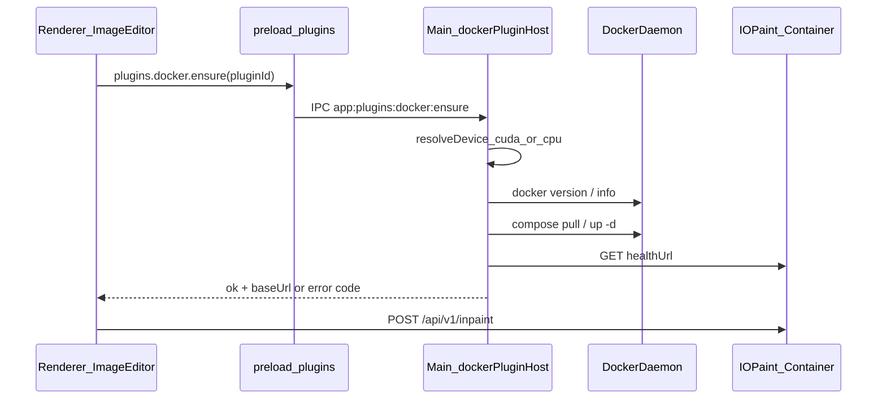

# Docker 本地插件宿主（替代本机 venv）

> **说明**：本文为实施计划与工作分解，与 Cursor 侧 plan 同步；**以本仓库 `docs` 为准**继续审阅与迭代。落地实施后可于文末追加用户手册、运维与镜像版本策略。

## 目标

- **仅保留 Docker 路径**：删除/停用 [`electron/main/lamaCleanerHost.ts`](../electron/main/lamaCleanerHost.ts) 中 venv、[`openLamaCleanerInstallTerminal`](../electron/main/lamaCleanerHost.ts)、以及 [`hostedPipPlugin.ts`](../electron/main/hostedPipPlugin.ts) 中仅为 Lama 终端安装服务的逻辑（若文件仅被 Lama 使用可整体删除或缩成 Docker 专用小工具）。
- **用户体验**：进入「擦除」等能力前，统一走 **Docker 已安装 → 守护进程可用 → 镜像存在（否则 pull）→ 容器运行 → HTTP 健康**；缺失时用 Modal 提示安装/打开 Docker Desktop，并提供重试。
- **推理设备**：宿主在 `ensure` 时 **判断是否可用 CUDA**，向容器传入 **`iopaint start ... --device cuda` 或 `--device cpu`**（与 IOPaint CLI 一致）；无 NVIDIA / 无驱动 / 无容器 GPU 支持时安全回退 **cpu**。
- **通用性**：抽象「插件 Docker 描述符」，后续其他模型类插件（同类 HTTP 本地服务）只增描述符 + `docker/` 下 compose/Dockerfile，不复制一套 IPC；`deviceStrategy` 可复用（`cuda|cpu` 或仅 cpu）。

## 架构（数据流）

- 现有 [`src/components/imageEditor/lamaInpaintApi.ts`](../src/components/imageEditor/lamaInpaintApi.ts) **不变**（仍对 `baseUrl` 发 HTTP）。
- `LAMA_CLEANER_PORT = 9380`（见 `lamaCleanerHost.ts`）可保留为常量，或由 compose 端口映射锁定（宿主仍为 `127.0.0.1:9380`）。

## CUDA / `--device` 策略（实施约定）

1. **解析入口**（建议 `resolveLamaDevice()` 或 registry 通用 `resolveComputeDevice(plugin)`）：
   - **首选**：在本机执行 `nvidia-smi`（`execFile`，短超时）；**退出码 0 且输出合理** 则认为 **具备本地 NVIDIA 驱动**。
   - **可选加强**（避免「有驱动但 Docker 未装 nvidia-container-toolkit」）：在 daemon 可用后增加一步 `docker run --rm --gpus all … nvidia-smi`（镜像可用小型官方 cuda base）；失败则 **回退 cpu**，并在日志/错误信息中提示检查 NVIDIA Container Toolkit。
   - **macOS**：通常无 NVIDIA CUDA，**默认 cpu**（不尝试 cuda）。
2. **传入 IOPaint**：容器启动命令或环境变量将结果映射为 **`--device cuda`** 或 **`--device cpu`**（与当前 IOPaint 参数一致；若后续需 `mps` 再扩展 registry，本阶段只做 cuda/cpu）。
3. **Compose**：
   - **cpu**：默认 service，无 GPU 保留。
   - **cuda**：使用 `deploy.resources.reservations.devices`（Compose v3 扩展）或文档规定的 `runtime: nvidia` 写法；**与 Docker Desktop / Linux 文档对齐**。实施时于**本文末**或后续章节写明「启用 GPU 的前置条件」。
4. **配置覆盖（可选后期）**：用户设置里「强制 CPU」覆盖自动检测，便于排错（可在 registry 的 `ensure` 选项中预留）。

## 仓库布局（建议）

| 路径 | 作用 |
|------|------|
| `docker/plugins/lama-cleaner/Dockerfile` | **Python 3.10** 基础镜像，安装 `lama-cleaner`/`iopaint`，默认入口可被 compose 覆盖 |
| `docker/plugins/lama-cleaner/compose.yaml` | `services.iopaint`、端口 `9380:9380`、**按 profile 或环境变量** 挂载 GPU / 传 `--device`；可选数据卷（模型缓存） |
| `electron/main/dockerPluginRegistry.ts` | 插件 id → `{ composeDirName, projectName, healthPath, hostPort, pullPolicy, supportsCuda }` |
| `electron/main/dockerPluginHost.ts` | 通用：`checkDockerAvailable`、`resolveDevice`、`ensureImage`、`composeUp`、`isHealthy`、统一错误码 |

开发与打包注意：`compose.yaml` 与 `Dockerfile` 需从 **`app.isPackaged` 时 `process.resourcesPath`**（或 `app.getAppPath()`）解析绝对路径；开发态指向仓库根下 `docker/plugins/...`。

## 主进程能力（通用）

1. **`docker info` / `docker version`**（或等价）：判断 CLI 与 **daemon 是否就绪**；失败时返回明确类型：`DOCKER_NOT_INSTALLED` | `DOCKER_DAEMON_DOWN` | `DOCKER_PERMISSION`（便于 UI 文案）。
2. **`resolveDevice`**：见上文 CUDA/cpu 策略；结果写入环境变量供 `docker compose` 使用（例如 `YIMAN_IOPAINT_DEVICE=cuda|cpu`）。
3. **镜像**：`docker compose -f ... pull`（或 `docker image inspect`）；可结合 `COMPOSE_PROFILES` / `--profile cuda` 扩展。
4. **运行**：`docker compose -f ... up -d`；幂等（已运行则跳过）；**若 device 从 cuda 切到 cpu 或相反**，需定义是否 `compose down` + 再起（首版可要求用户「切换后重试连接」或自动 down 该 service）。
5. **健康**：沿用现有 `httpPing`（`electron/main/hostedPipPlugin.ts`）思路，对 `http://127.0.0.1:${port}${healthPath}` 探测（Lama：`/api/v1/server-config`）。
6. **日志/排错（可选 v1）**：`docker compose logs --tail=50` 附在错误详情（开发模式）。

## IPC / Preload 设计

- 将分散的 `app:plugins:lama:*` **收敛或薄封装**为通用 IPC，例如：
  - `app:plugins:docker:ensure` → 参数 `{ pluginId: 'lama-cleaner' }`，返回 `{ ok, baseUrl?, code?, error?, device?: 'cuda' | 'cpu' }`（device 可选，供 UI 展示）
  - `app:plugins:docker:openDocs`（可选）→ `shell.openExternal` 指向 Docker 安装页
- [`electron/preload/index.ts`](../electron/preload/index.ts)：`plugins.docker.ensure(pluginId)`，保留 `lamaCleanerEnsure` 为**兼容别名**（内部调 `docker.ensure('lama-cleaner')`），减少前端大改。
- [`src/vite-env.d.ts`](../src/vite-env.d.ts) 同步类型。

## 渲染进程（[`ImageEditorPage.tsx`](../src/components/imageEditor/ImageEditorPage.tsx)）

- 安装 Modal 改为 **Docker 引导**：未安装/未启动 vs 拉镜像中 vs 启动失败；去掉「终端 venv / 环境变量逐行输入」文案与 `openLamaCleanerOpenInstallTerminal` 按钮。
- 可选展示本次 `ensure` 选用的 **cpu/cuda**（若 IPC 返回），减少「为何很慢」的疑惑。
- 按钮语义：`重试连接` → 再次 `ensure`；可选「打开 Docker Desktop」→ `shell.openPath`（mac 上 `open -a Docker` 需主进程封装处理）。

## 删除与清理范围

- 移除 venv 相关：`getLamaVenvRoot`、`openMacPipInstallScript` 的 Lama 专用调用、`ImageEditorPage` 中 terminal 安装相关 handler。
- [`electron/main/index.ts`](../electron/main/index.ts)：移除或替换 `app:plugins:lama:openInstallTerminal`。

## 实施后需补充的正文（占位）

实施完成后建议在本节之下追加：

- 用户前置：安装 Docker Desktop、**NVIDIA 驱动与（Linux/WSL）nvidia-container-toolkit**、首次 pull 体积与网络说明。
- **Python 3.10** 与 IOPaint 镜像构建说明。
- **自动 cuda/cpu** 行为与手动强制 CPU（若实现设置项）。
- 开发者：如何新增插件（registry 一项 + `docker/plugins/<id>/`）、端口约定、健康检查路径、`supportsCuda`、调试命令。
- 打包：Electron 资源路径与大版本升级时镜像 tag 策略。

## 风险与约束

- **macOS + Apple Silicon**：基础镜像需支持 `arm64`；**本地 CUDA 推理通常不可用**，计划默认 **cpu**。
- **Linux / Windows WSL2 + NVIDIA**：需 **Docker GPU 支持** 与正确 compose 字段；否则自动回退 **cpu**。
- **device 切换**：同一插件从 cuda 改 cpu（或相反）时容器需重建的策略在实施时需写清（自动 vs 手动重试）。
- **体积与时间**：首次 `pull` 可能很久；UI 需文案管理预期（不必首版就做完整进度条）。

## 实施顺序建议

1. 新增 `docker/plugins/lama-cleaner/`（**Python 3.10**，验证 **cpu** 与 **cuda**（在有 GPU 的机器上）`compose up`）。
2. 实现 `dockerPluginHost.ts` + registry（含 **`resolveDevice`**）+ IPC + preload。
3. 重写 `ensureLamaCleanerRunning` 为调用通用宿主（或删除该文件合并入 host）。
4. 更新 `ImageEditorPage` Modal 与错误映射。
5. 删除 venv/终端安装代码与无用 IPC。
6. **在本文件补全「实施后需补充的正文」**，并在 [`docs/03-开发计划和进度.md`](03-开发计划和进度.md) 增加对应 Todo 勾选说明（若项目惯例要求）。
